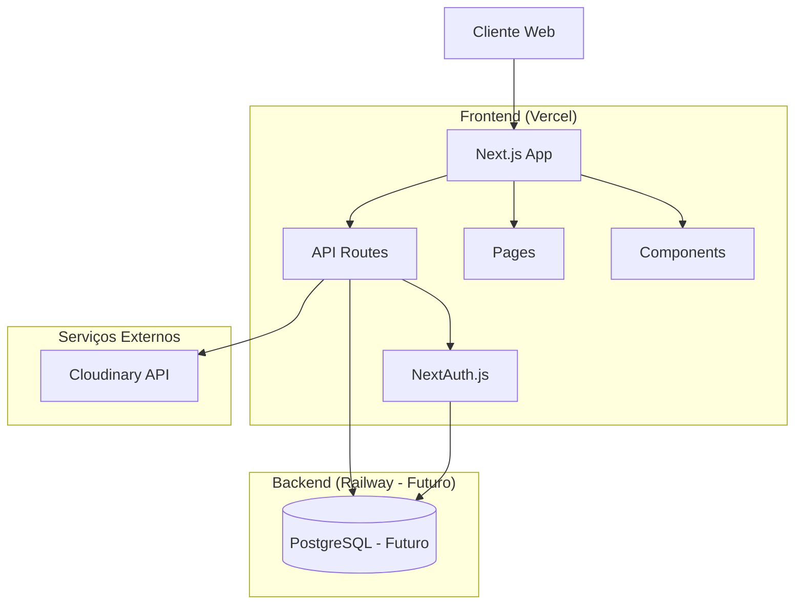
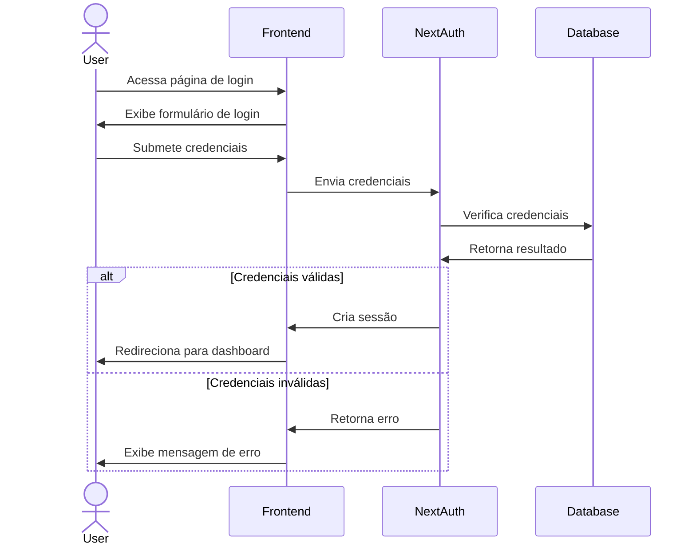
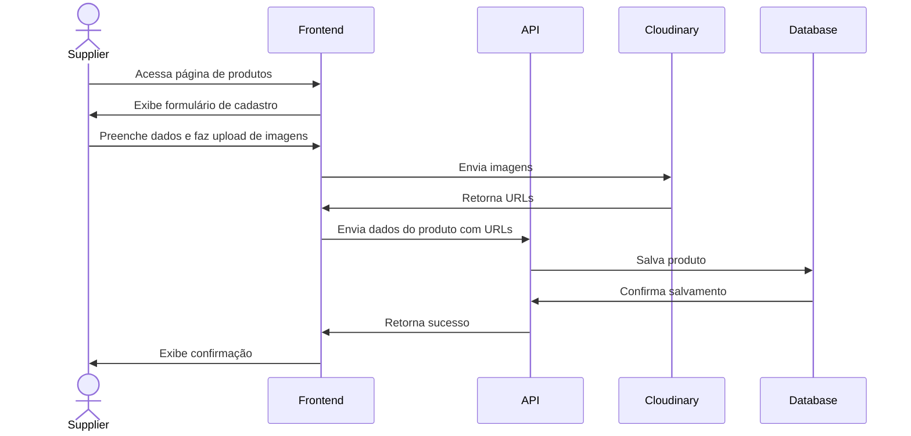
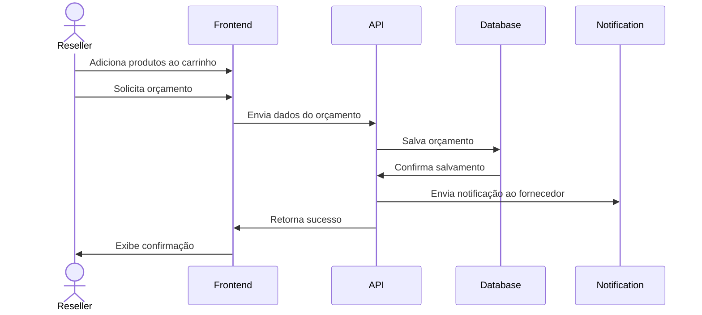

# Design Document - SPECS (Sistema de Representantes e Fornecedores)

## Overview

O SPECS é um portal web que conecta fornecedores de moda com seus revendedores, permitindo o gerenciamento de produtos, revendedores e pedidos. Este documento detalha a arquitetura técnica e o design do sistema, com foco na implementação frontend-first utilizando Next.js 14 e Tailwind CSS, com planos para expansão futura incluindo um backend completo com PostgreSQL e Prisma.

O design visual e a experiência do usuário serão baseados no projeto piloto PulseHub, mantendo sua identidade visual moderna e intuitiva. O sistema utilizará o mesmo esquema de cores (azul royal como cor primária e verde-menta como secundária), a fonte Poppins como tipografia principal, e elementos de UI consistentes como cards com efeito glassmorphism, gradientes sutis e animações de elementos para melhorar a experiência do usuário.

## Arquitetura

O sistema seguirá uma arquitetura de aplicação web moderna, com separação clara entre frontend e backend, utilizando APIs RESTful para comunicação entre as camadas.



### Abordagem Frontend-First

O desenvolvimento seguirá uma abordagem frontend-first, onde inicialmente:

1. O frontend será construído com dados mockados
2. As APIs serão implementadas como rotas API do Next.js
3. O armazenamento temporário será feito em localStorage/cookies
4. Em uma fase posterior, será implementado o backend completo com PostgreSQL

Esta abordagem permite entregar valor rapidamente, validando a interface e experiência do usuário antes de investir no desenvolvimento completo do backend.

## Design Visual e Identidade

### Esquema de Cores

Baseado no projeto piloto PulseHub, o sistema utilizará o seguinte esquema de cores:

```typescript
// Cores principais
colors: {
  primary: {
    DEFAULT: "#2563eb", // azul royal
    hover: "#1d4ed8",
  },
  secondary: {
    DEFAULT: "#10b981", // verde-menta
    hover: "#059669",
  },
  light: "#ffffff",
  dark: "#1f2937",
}
```

### Tipografia

A fonte principal será Poppins para todo o sistema, proporcionando uma aparência moderna e legível:

```typescript
fontFamily: {
  sans: ['Poppins', 'sans-serif'],
}
```

### Elementos de Design

- **Glassmorphism**: Cards e painéis com efeito de vidro translúcido (backdrop-blur) e bordas sutis
- **Gradientes**: Fundos com gradientes suaves de azul para verde
- **Sombras**: Elevação com sombras sutis para criar hierarquia visual
- **Animações**: Efeitos de hover, transições suaves e animações de carregamento
- **Bordas arredondadas**: Elementos com cantos arredondados (border-radius) para uma aparência amigável
- **Efeitos de pulsação**: Animações sutis para chamar atenção para elementos importantes

### Logo e Branding

O sistema utilizará o logo do PulseHub, que consiste em:
- Um círculo roxo com ondas de áudio/pulso em branco
- Efeito de pulsação animado
- Texto "Pulse" em roxo e "Hub" em verde-água

## Componentes e Interfaces

### Estrutura de Diretórios

```
/
├── app/
│   ├── api/                    # Rotas de API
│   │   ├── auth/               # Autenticação (NextAuth)
│   │   ├── products/           # API de produtos
│   │   ├── resellers/          # API de revendedores
│   │   └── orders/             # API de pedidos
│   ├── (auth)/                 # Rotas de autenticação
│   │   ├── login/              # Página de login
│   │   ├── register/           # Página de cadastro
│   │   └── forgot-password/    # Recuperação de senha
│   ├── supplier/               # Área do fornecedor
│   │   ├── dashboard/          # Dashboard do fornecedor
│   │   ├── products/           # Gerenciamento de produtos
│   │   ├── resellers/          # Gerenciamento de revendedores
│   │   └── orders/             # Gerenciamento de pedidos
│   ├── reseller/               # Área do revendedor
│   │   ├── dashboard/          # Dashboard do revendedor
│   │   ├── catalog/            # Catálogo de produtos
│   │   └── orders/             # Pedidos e orçamentos
│   └── page.tsx                # Página inicial
├── components/                 # Componentes reutilizáveis
│   ├── ui/                     # Componentes de UI básicos
│   ├── forms/                  # Componentes de formulário
│   ├── layout/                 # Componentes de layout
│   └── shared/                 # Componentes compartilhados
├── lib/                        # Utilitários e helpers
│   ├── auth.ts                 # Configuração de autenticação
│   ├── cloudinary.ts           # Integração com Cloudinary
│   └── db.ts                   # Conexão com banco (futuro)
├── models/                     # Modelos de dados
├── public/                     # Arquivos estáticos
└── styles/                     # Estilos globais
```

### Principais Componentes

#### Autenticação e Autorização

- **AuthProvider**: Componente de contexto para gerenciar estado de autenticação, similar ao AuthContext do projeto piloto
- **ProtectedRoute**: HOC para proteger rotas que requerem autenticação
- **RoleBasedAccess**: Componente para controle de acesso baseado em função (fornecedor/revendedor)
- **ThemeToggle**: Componente para alternar entre temas claro e escuro

#### Interface do Fornecedor

- **ProductForm**: Formulário para criação e edição de produtos com validação em tempo real
- **ImageUploader**: Componente para upload de imagens para o Cloudinary com preview
- **InputBRL**: Componente especializado para entrada de valores monetários em Real brasileiro
- **ProductCard**: Card de produto com imagem, nome, preço e ações (similar ao do projeto piloto)
- **ProductSuccessPage**: Página de confirmação após cadastro/edição de produto
- **ResellerManager**: Interface para gerenciamento de revendedores
- **OrdersTable**: Tabela para visualização e gerenciamento de pedidos
- **ReportGenerator**: Componente para geração de relatórios

#### Interface do Revendedor

- **ProductCatalog**: Catálogo de produtos com filtros e paginação
- **ProductDetail**: Visualização detalhada de produto com galeria de imagens
- **ProductCard**: Card de produto com imagem, nome, preço e ações rápidas
- **ShoppingCart**: Carrinho para seleção de produtos com cálculo de totais
- **QuoteRequest**: Formulário para solicitação de orçamentos
- **OrderHistory**: Histórico de pedidos e orçamentos com status visual
- **Toast**: Componente para notificações e feedback ao usuário

## Modelos de Dados

### User

```typescript
interface User {
  id: string;
  name: string;
  email: string;
  password: string; // Hashed
  role: 'supplier' | 'reseller';
  createdAt: Date;
  updatedAt: Date;
}

// Extensão para Fornecedor
interface Supplier extends User {
  companyName: string;
  logo?: string;
  address?: Address;
  phone?: string;
  resellers: Reseller[];
  products: Product[];
}

// Extensão para Revendedor
interface Reseller extends User {
  supplierId: string;
  supplier: Supplier;
  status: 'active' | 'inactive' | 'pending';
  orders: Order[];
}
```

### Product

```typescript
interface Product {
  id: number;
  supplierId: string;
  name: string;
  description?: string;
  price: number;
  imageUrls?: string[]; // URLs do Cloudinary
  category?: Category | number; // Pode ser o objeto categoria ou apenas o ID
  categoryId?: number;
  sizes?: string[]; // Tamanhos selecionados para este produto
  targetAudiences?: TargetAudience[]; // Múltiplos públicos-alvo
  featured: boolean;
  createdAt?: Date;
  updatedAt?: Date;
}

interface Size {
  value: string;
  label: string;
}

interface TargetAudience {
  id: string;
  name: string;
}

interface Category {
  id: number;
  name: string;
  description?: string;
  // Tamanhos disponíveis para esta categoria (opcional)
  availableSizes?: Size[];
}

// Constantes para uso em toda a aplicação
const DEFAULT_TARGET_AUDIENCES: TargetAudience[] = [
  { id: 'masculino', name: 'Masculino' },
  { id: 'feminino', name: 'Feminino' },
  { id: 'infantil', name: 'Infantil' },
  { id: 'unissex', name: 'Unissex' },
  { id: 'plus-size', name: 'Plus Size' },
  { id: 'gestante', name: 'Gestante' },
  { id: 'pet', name: 'Pet' },
];

// Tamanhos padrão por tipo de produto
const DEFAULT_SIZES = {
  roupas: [
    { value: 'PP', label: 'PP' },
    { value: 'P', label: 'P' },
    { value: 'M', label: 'M' },
    { value: 'G', label: 'G' },
    { value: 'GG', label: 'GG' },
    { value: 'XG', label: 'XG' },
  ],
  calcados: [
    { value: '34', label: '34' },
    { value: '35', label: '35' },
    // ... outros tamanhos
  ],
  acessorios: [
    { value: 'unico', label: 'Único' },
    { value: 'P', label: 'P' },
    { value: 'M', label: 'M' },
    { value: 'G', label: 'G' },
  ],
  infantil: [
    { value: 'RN', label: 'RN' },
    { value: '1-3M', label: '1-3M' },
    // ... outros tamanhos
  ],
};
```

### Order

```typescript
interface Order {
  id: string;
  supplierId: string;
  resellerId: string;
  status: 'pending' | 'approved' | 'shipped' | 'delivered' | 'canceled';
  items: OrderItem[];
  totalAmount: number;
  createdAt: Date;
  updatedAt: Date;
  notes?: string;
  invoice?: string; // URL do documento
}

interface OrderItem {
  id: string;
  orderId: string;
  productId: string;
  variantId: string;
  quantity: number;
  unitPrice: number;
}
```

### Quote

```typescript
interface Quote {
  id: string;
  supplierId: string;
  resellerId: string;
  status: 'pending' | 'approved' | 'rejected' | 'expired';
  items: QuoteItem[];
  totalAmount: number;
  validUntil: Date;
  createdAt: Date;
  updatedAt: Date;
  notes?: string;
}

interface QuoteItem {
  id: string;
  quoteId: string;
  productId: string;
  variantId: string;
  quantity: number;
  unitPrice: number;
}
```

## Fluxos de Dados

### Autenticação



### Cadastro de Produto (Fornecedor)



### Solicitação de Orçamento (Revendedor)



## Estratégia de Armazenamento

### Fase 1: Frontend-First (MVP)

- **Autenticação**: JWT armazenado em cookies HTTP-only
- **Dados temporários**: localStorage para carrinho e preferências
- **Imagens**: Cloudinary (desde o início)
- **Dados mockados**: Arquivos JSON estáticos para desenvolvimento inicial

### Fase 2: Backend Completo

- **Banco de dados**: PostgreSQL hospedado no Railway
- **ORM**: Prisma para modelagem e acesso a dados
- **Migrações**: Gerenciadas pelo Prisma
- **Backup**: Configurado no Railway com retenção de 7 dias

## Tratamento de Erros

### Frontend

- Implementação de interceptores para requisições HTTP
- Feedback visual para erros de formulário com validação em tempo real
- Componente de notificação para exibir mensagens de erro/sucesso
- Páginas de erro personalizadas para códigos HTTP comuns (404, 500)

### API

- Respostas de erro padronizadas com códigos HTTP apropriados
- Logging estruturado para facilitar depuração
- Rate limiting para prevenir abuso
- Validação de entrada com Zod ou similar

## Estratégia de Testes

### Testes Unitários

- **Frontend**: Jest + React Testing Library para componentes
- **API**: Jest para funções e serviços

### Testes de Integração

- Testes de fluxos completos usando Cypress
- Mocks para serviços externos (Cloudinary)

### Testes de UI

- Testes de acessibilidade com axe-core
- Testes de responsividade em diferentes breakpoints

## Considerações de Segurança

- Autenticação com NextAuth.js e JWT
- Proteção contra CSRF
- Validação de entrada em todas as APIs
- Sanitização de saída para prevenir XSS
- Rate limiting para prevenir ataques de força bruta
- Permissões baseadas em função (RBAC)

## Estratégia de Implantação

### Ambientes

- **Desenvolvimento**: Local + Vercel Preview Deployments
- **Staging**: Branch de staging na Vercel
- **Produção**: Branch main na Vercel + Railway (futuro)

### CI/CD

- GitHub Actions para testes automatizados
- Vercel para deploy automático do frontend
- Railway para deploy automático do backend (futuro)

## Escalabilidade e Performance

### Otimizações Frontend

- Lazy loading de componentes e imagens
- Implementação de ISR (Incremental Static Regeneration) para páginas de catálogo
- Otimização de imagens via Cloudinary
- Caching de API com SWR ou React Query

### Otimizações Backend (Futuro)

- Índices de banco de dados otimizados
- Caching com Redis
- Paginação para endpoints que retornam muitos dados

## Acessibilidade

- Conformidade com WCAG 2.1 nível AA
- Suporte a navegação por teclado
- Testes com leitores de tela
- Contraste adequado e tamanhos de fonte ajustáveis
- Textos alternativos para imagens

## Internacionalização (Futuro)

- Estrutura para suporte a múltiplos idiomas
- Formatação de números, datas e moedas específicas por região
- Textos traduzíveis em arquivos de recursos